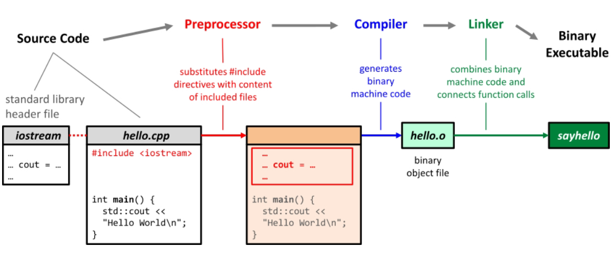

# Examen Junio 2021
**Lea detenidamente estas instrucciones:**
 * No escriba nada en las casillas de la parte superior de esta página.
 * El examen consta de 5 preguntas y el tiempo disponible es de 3 horas.
 * Realice cada ejercicio con bolígrafo en un FOLIO DISTINTO y entregue los ejercicios en orden.
 * Ponga nombre, apellidos y DNI en todos los folios que utilice.
 * Al finalizar el examen, ENTREGUE TODOS LOS FOLIOS que haya utilizado, incluyendo éste.
 * Al entregar el examen muestre algún documento que acredite su identidad.

## Preguntas Teóricas
### Ejercicio 01 - 2pts
**Describa qué es una dirección IP, cuál es su estructura y qué rol juega a la hora de comunicar dispositivos electrónicos dentro de una red.**

Una dirección IP es un identificador único de cada dispositivo conectado a una red (protocolo *TCP/IP*). Éstas pueden ser estáticas, es decir que no varía, o dinámicas, que son las que son otorgadas temporalmente. Existen dos tipos de direcciones IP:
 * ***IPv4*** (32 bits): La mayoría de dispositivos utilizan este tipo de dirección. Su espacio permite tener direcciones con cualquier combinación numérica comprendida dentro del rango 0.0.0.0 a 255.255.255.255 (ambos inclusive); sin embargo, algunas direcciones se encuentran reservadas para ciertas finalidades dentro de las redes *TCP/IP*.
 * ***IPv6*** (128 bits): Su espacio es bastante mayor que el de las direcciones IPv4, y debido a la gran demanda de direcciones IP, cada vez más dispositivos aceptan este tipo de dirección, Están divididas en dos partes:
   * ***Componente de Red***: Son los primeros 64 bits de la dirección y se emplean para enrutamiento.
   * ***Componente de Nodo***: Son los 64 bits restantes de la dirección y se emplean para identificar la dirección de la interfaz (deriva de la dirección física o MAC).
 
    A diferencia de las direcciones IPv4 que se representan en notación decimal, se representan en notación hexadecimal.

        2001:0DB8:AC10:FE01:0000:0000:0000:0000
        |__________________||__________________|
                 |                   |
           Comp. de Red        Comp. de Nodo 
             (64 bits)      (0s se pueden omitir)
                                 (64 bits)

### Ejercicio 02 - 2pts
**Describa detalladamente cuáles son y en qué consisten las distintas etapas de construcción de software (programa) en C++, desde los archivos de código fuente hasta obtener un archivo ejecutable. Ponga un ejemplo ilustrativo de cada una de estas etapas.**

La construcción de software en C++, se produce a través de un proceso en el cual se traduce el código (escrito en un lenguaje legible para el ser humano) a código-máquina (binario) de manera que se produzca un archivo ejecutable por el dispositivo. Este proceso consta de cuatro fases:
 * ***Preprocesado***: Se interpretan las llamadas directivas iniciadas por *#* (include, define, ifndef, pragma, ...); se sustituyen por el código correspondiente constenido en las librerías en el caso de *#include*. Se puede llamar al preprocesador de la siguinete manera:

      $ cpp file.cc

 * ***Compilado***: Se convierte el código en C++ (*.cc) a código en lenguaje Assembly o ensamblador (*.s); este proceso es local para cada fichero por separado. En Linux, se pueden emplear dos compiladores, *Clang* y *GCC* (**G**NU **C**ompiler **C**ollection); g++ se encuentra dentro de éste último.
    El comando *g++* permite opciones de compilado y linkeado.

      $ g++ \[opciones\] input_file
    
    Algunas opciones útiles de g++:
     * ***-o***: Proveer de un nombre al fichero de salida.
     * ***-std=c++17***: Interpretar el código según el estándar de C++17.
     * ***-g***: Mantener los símbolos de debugueado.
     * ***-O0***: No optimizar el proceso.
     * ***-O3***: Optimizar el proceso al máximo.

 * ***Ensamblado***: Se convierte el código en ensamblador (*.s) a código binario u objeto (*.o); este proceso también es local para cada fichero.
    Para producir el código en ensamblador:

      $ g++ -m64 -masm=intel -S file.cc -o file.s

    Para producir el código objeto:

      $ g++ -c file.cc -o file.o

 * ***Linkeado***: Se combinan todos los ficheros objeto (*.o) en un único fichero ejecutable. En este proceso se comprueba que todas las funciones estén correctamente implementadas.
    Para producir el ejecutable:

      $ g++ -o program file.o
               o
      $ g++ -o program file.cc

Una vez completadas estas cuatro fases, se puede ejecutar el programa directamente de la siguiente manera:

    $ ./program [argumentos necesarios]

## Preguntas Prácticas
### Ejercicio 03 - 2pts
**Escriba un programa switch_case que modifique todas las letras de una cadena de forma que transforme todas las mayúsculas en minúsculas y viceversa. Los caracteres que no sean mayúsculas ni minúsculas no debieran verse modificados.**

    $ ./switch_case Abecedario
    aBECEDARIO

    $ ./switch_case PyThon
    pYtHON

### Ejercicio 04 - 2pts
**A continuación encontrará la definición parcial de la clase Box en C++, que representa una caja a través de su largo, fondo y alto. Complete la clase con los constructores que considere oportunos y la sobrecarga de operadores ==, extracción a través *ostream* e inserción a través de istream. Finalmente, implemente una función principal donde se empleen los operadores sobrecargados.**

    class Box {
     public:
      int length() { return length_; }
      int breadth() { return breadth_; }
      int height() { return height_; }
     private:
      double length_;
      double breadth_;
      double height_;
    };

## Preguntas Tipo Test
### Ejercicio 05 - 2pts
**Responda Verdadero (V) o Falso (F) o elegir la/s respuesta/s correcta/s para cada una de las siguientes preguntas teniendo en cuenta las siguientes observaciones:**
 * **Por cada respuesta correcta se sumará 0.2 puntos.**
 * **Por cada respuesta incorrecta se restará 0.2 puntos.**
 * **Las preguntas sin responder se considerarán incorrectas.**
 * **La puntuación mínima de la pregunta es de 0 puntos.**

1. **El Gestor de Red es un componente habitual en un Sistema Operativo.**

2. **En la shell de Linux el directorio “home” del usuario se representa mediante el carácter /.**

3. **De acuerdo a la Guía de Estilo de código que se sigue en la asignatura, los identificadores de funciones ordinarias (no métodos de una clase) deben escribirse comenzando con letra minúscula y usando mayúscula para cada palabra.**

4. **En una relación de composición de objetos la parte (miembro) sólo puede pertenecer a un objeto (clase) a la vez.**

5. **El método emplace_back()de la clase std::vector se utiliza para eliminar el último elemento de unvector.**

6. **Al leer caracteres desde un flujo de entrada (cin) la lectura se detiene cuando se detecta un espacio en blanco o bien un retorno de carro (enter).**

7. **Una función declarada "friend" de una clase puede acceder para escritura los miembros de datos (atributos) de esa clase.**

8. **Los operadores unarios debieran sobrecargarse usando métodos de la clase.**

9. **El espacio de direcciones que permite IPv4 es mayor que el que utiliza IPv6.**

10. **El lenguaje SQL se utiliza para realizar operaciones CRUD en bases de datos no relacionales.**

